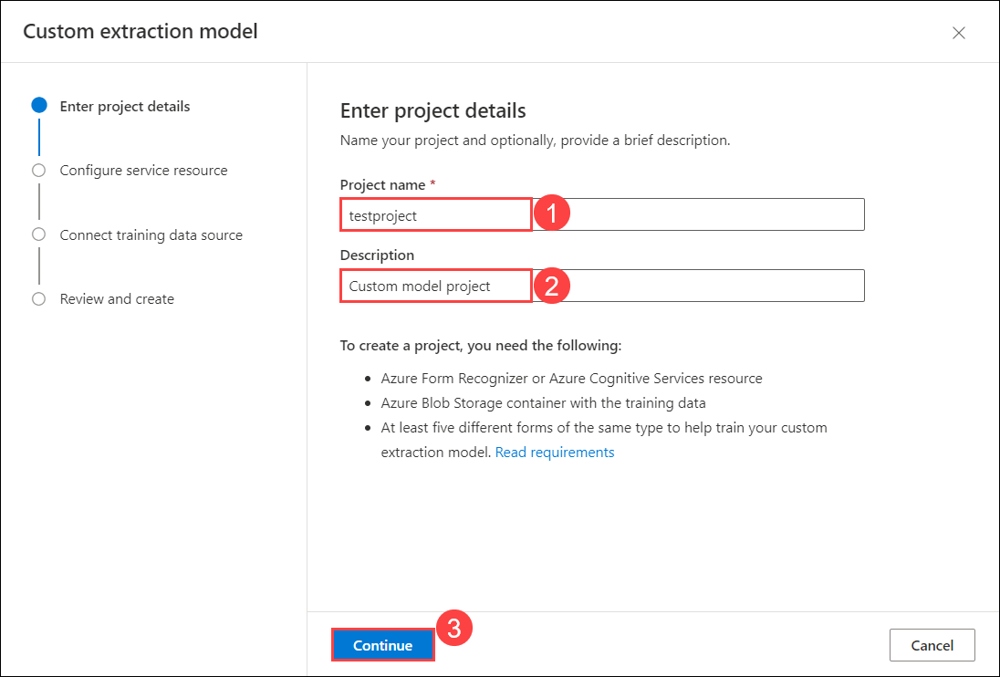
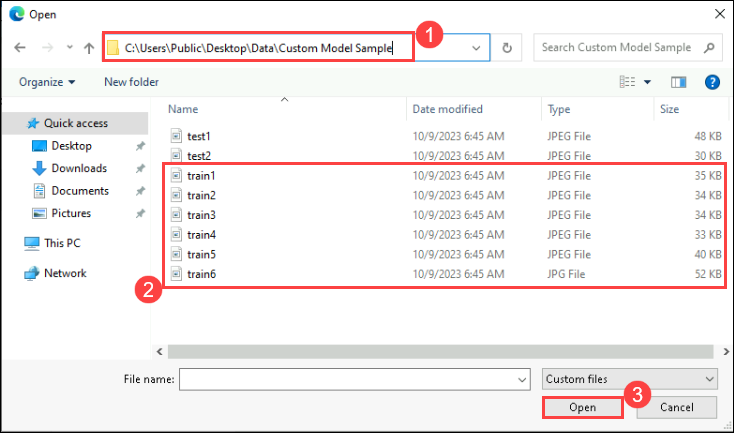
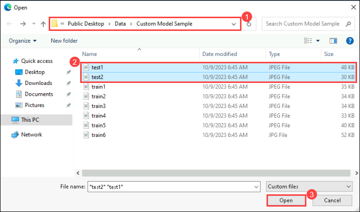
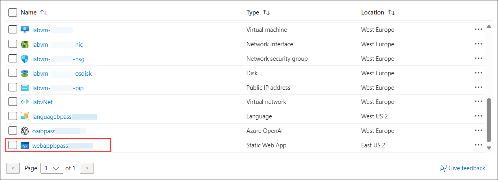
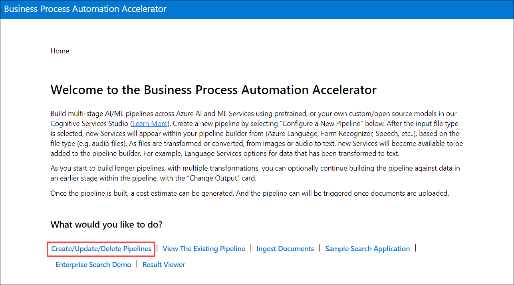
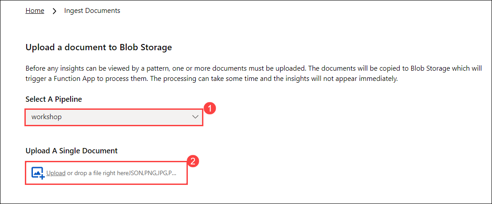
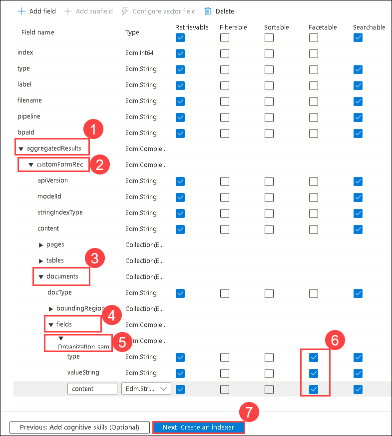

# Automate document processing using AzureOpenAI

### Lab Overview

Processing of forms and documents is part of several scenarios both in business and in everyday life. Manual data extraction from documents, either in electronic or printed format, is time-consuming, costly, and error-prone.

Azure Form Recognizer is an Applied AI Service that enables you to extract text, table data, key-value pairs, and layout information from forms and documents. In this lab, you will learn how to use train documents via Document Intelligence resource and further processing the documents to Cosmos DB via Azure functions. 

### Lab Objectives

In this lab, you will perform:

- Provision a Form Recognizer resource.
- Train a custom model in Form Recognizer Studio.
- Create an Azure Functions project.
- Store the extracted information from the Form Recognizer’s model in Azure Cosmos DB.
- Use Power BI to visualize the insights from the analysis of the forms.

### Instructions

### Task 1: Creating a Document Intelligence Resource

1. Search for **Document Intelligence** and select it.

   

1. Navigate to **Document-Intelligence-<inject key="Deployment ID" enableCopy="false"/>**
     

1. In the **Overview** pane, under **Document Intelligence studio** ,click on **Try it**.

   

1. In **Document Intelligence studio**, scroll down to **Custom Models** and click on **Get Started**.

   

1. Enter the following details and click on **Continue**  **(3)**.
    
   - Project name: **testproject** **(1)**.
   - Description: **Custom model project** **(2)**.

     

1. Enter the following details **Configure service resource** and click on **Continue** **(5)**.

   - Subscription: Select your **Default Subscription** **(1)**.
   - Resource group: **OpenAI-<inject key="Deployment ID" enableCopy="false"/>** **(2)**.
   - Document Intelligence or Cognitive Service Resource: Select **Document-Intelligence-<inject key="Deployment ID" enableCopy="false"/>** **(3)**.
   - API version: **Select the default version** **(4)**.

     

1. Enter the following details **Connect training data source** and click on **Continue** **(5)**.

   - Subscription: Select your **Default Subscription** **(1)**.
   - Resource group: **Document-intelligence-<inject key="Deployment ID" enableCopy="false"/>** **(2)**.
   - Storage account name: Select **storage<inject key="Deployment ID" enableCopy="false"/>** **(3)**.
   - Blob container name: **documents** **(4)**.
   
        

1. Validate the information and choose **Create project**.

     

### Task 2: Train and Label data

In this step, you will upload 6 training documents to train the model.

1. Click on **Browse for files**.

     

2.  On the file explorer, enter the following `C:\Users\Public\Desktop\Data\Custom Model Sample` **(1)** path hit **enter**, select all train JPEG files **train1 to train6** **(2)**, and hit **Open** **(3)**.

     

3. Once uploaded, choose **Run now** in the pop-up window under Run Layout.

     

4. Click on **+ Add a field** **(1)**, select **Field** **(2)**, enter the field name as **Organization_sample** **(3)** and hit **enter**.

     

     

5. Label the new field added by selecting **CONTOSO LTD** in the top left of each document uploaded. Do this for all six documents.

     

6. Once all the documents are labeled, click on **Train** in the top right corner.

     

7. Specify the model ID as **customfrs** **(1)**, Model Description as **custom model** **(2)**, from the drop-down select **Template** **(3)** as Build Mode and click on **Train** **(4)**.

     

8. Click on **Go to Models**. 

   

9. Wait till the model status shows **succeeded** **(1)**. Once the status Select the model **customfrs** **(2)** you created and choose **Test** **(3)**.

     

10. On the Test model window, click on **Browse for files**. 

     

11. On the file explorer, enter the following `C:\Users\Public\Desktop\Data\Custom Model Sample` **(1)** path hit **enter**, select all test JPEG files **test1 and test2** **(2)**, and hit **Open** **(3)**.

     

12. Once uploaded, select one test model, and click on **Run analysis** **(1)**, Now you can see on the right-hand side that the model was able to detect the field **Organization_sample** **(2)** we created in the last step along with its confidence score.

     

### Task 3: Build a new pipeline with the custom model module in BPA

After you are satisfied with the custom model performance, you can retrieve the model ID and use it in a new BPA pipeline with the Custom Model module in the next step.

1. Navigate back to the Resource groups and select the resource group **business-process -<inject key="Deployment ID" enableCopy="false"/>**.

    

2. Go to the Resource group, search, and select the **Static Web App** resource type with the name similar to **webappbpa{suffix}**.

   

3. On the **Static Web App** page, click on **View app in browser**.

      

4. Once the **Business Process Automation Accelerator** page loaded successfully, click on the **Create/Update/Delete Pipelines**. 

   

5. On the **Create Or Select A Pipeline** page, enter New Pipeline Name as **workshop** **(1)**, and click on the **Create Custom Pipeline** **(2)**. 

   

6. On the **Select a document type to get started** page, select **PDF Document**

   

7. On the **Select a stage to add it to your pipeline configuration** page, search and select for **Form Recognizer Custom Model (Batch)**.

   

8. On the pop-up, enter the Model ID as **customfrs** **(1)** and click on **Submit** **(2)**. 

   

9. On the **Select a stage to add it to your pipeline configuration** page, scroll down to review the **Pipeline Preview**, and click on **Done**.

   

10. On the **Piplelines workshop** page, click on **Home**. 

      

11. On the **Business Process Automation Accelerator** page, click on **Ingest Documents**.

      

12. On the **Upload a document to Blob Storage** page, from the drop-down select a Pipeline with the name **workshop** **(1)**, and click on **Upload or drop a file right here**.

      

13. For documents, enter the following `C:\Users\Public\Desktop\Data\Lab 1 Step 3.7` **(1)** path and hit enter. You can upload multiple invoices one by one.

      

### Task 4: Configure Azure Cognitive Search 

1. Navigate back to the resource group window, search, and select **Search Service** with a name similar to **bpa{suffix}**.

   

2. On the **Search service** page, click on **Import data**.

   

3. Enter the following details for **Connect to your data**.

   - Data Source: Select **Azure Blob Storage** **(1)**
   - Data Source Name: Enter **workshop** **(2)**.
   - Parsing mode: Select **JSON** **(3)**.
   - Click on **Choose an existing connection** **(4)** under Connection string.
  
     

4. On the **Storage accounts** page, select the storage account named similar to **bpass{suffix}**. 

     

5. Select **results** **(1)** container from the **Containers** page and click on **Select** **(2)**. It will redirect back to **Connection to your data** page.

        
  
6. On the **Connect to your data** page, enter the **workshop** **(1)** as **Blob folder** and click on **Next : Add cognitive skills (Optional) (2)**.

   .png)

7. On the **Add cognitive skills (Optional)** click on **Skip to : Customize target index**.

8. On the **Customize target index**, enter Index name as **azureblob-index** **(1)**, make all fields **Retrievable** **(2)**, and **Searchable** **(3)**.

      

9. Expand the **aggregatedResults** **(1)** > **customFormRec** **(2)** > **documents** **(3)** > **fields** **(4)** under it, expand **Organization_sample (5)**. Make the three fields Facetable **(type, valueString & content)** **(6)** and click on **Next: Create an indexer** **(7)**.

      

7. On the **Create an indexer** page, enter the name as **azureblob-indexer** **(1)** and click on **Submit** **(2)**.
   
   

## Review

In this lab, you have accomplished the following:
