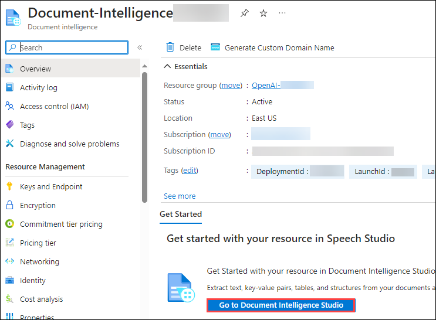
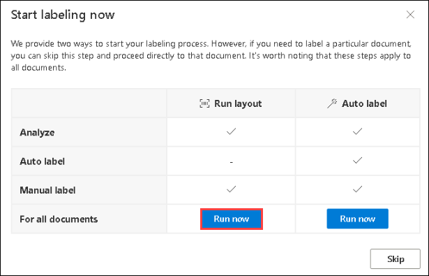
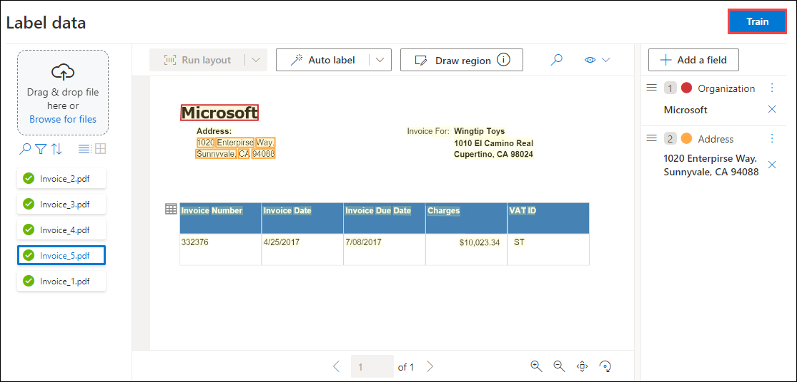

# Automate document processing using AzureOpenAI

### Lab Overview

Processing of forms and documents is part of several scenarios both in business and in everyday life. Manual data extraction from documents, either in electronic or printed format, is time-consuming, costly, and error-prone.

Azure Form Recognizer is an Applied AI Service that enables you to extract text, table data, key-value pairs, and layout information from forms and documents. In this lab, you will learn how to use train documents via Document Intelligence resource. We will be processing the documents to Cosmos DB via Azure functions and further analysing the document in Power BI. 

### Architecture Diagram

   

### Lab Objectives

In this lab, you will perform:

- Provision a Document Intelligence resource.
- Train a custom model in Document Intelligence Studio.
- Create an Azure Functions project and analyse the documents using function trigger.
- Use your own data with Azure OpenAI.
- Store the data in Cosmos DB and visualize in Power BI

### Instructions

### Task 1: Creating a Document Intelligence Resource

1. Search for **Document Intelligence** and select it.

   

1. Navigate to **Document-Intelligence-<inject key="Deployment ID" enableCopy="false"/>**

   

1. In the **Overview** pane, scroll down to **Get Started** tab and click on **Go to Document Intelligence studio**.

   

1. In **Document Intelligence studio**, scroll down to **Custom Models** and click on **Get Started**.

   

1. Enter the following details and click on **Continue**  **(3)**.
    
   - Project name: **testproject** **(1)**.
   - Description: **Custom model project** **(2)**.

     

1. Enter the following details **Configure service resource** and click on **Continue** **(5)**.

   - Subscription: Select your **Default Subscription** **(1)**.
   - Resource group: **OpenAI-<inject key="Deployment ID" enableCopy="false"/>** **(2)**.
   - Document Intelligence or Cognitive Service Resource: Select **Document-Intelligence-<inject key="Deployment ID" enableCopy="false"/>** **(3)**.
   - API version: **Select the default version** **(4)**.

     

1. Enter the following details **Connect training data source** and click on **Continue** **(5)**.

   - Subscription: Select your **Default Subscription** **(1)**.
   - Resource group: **Document-intelligence-<inject key="Deployment ID" enableCopy="false"/>** **(2)**.
   - Storage account name: Select **storage<inject key="Deployment ID" enableCopy="false"/>** **(3)**.
   - Blob container name: **analysis** **(4)**.
   
        

1. Validate the information and choose **Create project**.

     

### Task 2: Train and Label data

In this step, you will upload 6 training documents to train the model.

1. Click on **Browse for files**.

     

1. On the file explorer, enter the following `C:\LabFiles\Train`  path hit **enter**, select all train JPEG files present inside **Train** folder i.e **invoice_1 to invoice_5** **(2)**, and hit **Open** **(3)**.

   

1. Once uploaded, choose **Run now** in the pop-up window under Run Layout.

     

1. Click on **+ Add a field** **(1)**, select **Field** **(2)**, enter the field name as **Organization** **(3)** and hit **enter**.

     

     

1. Label the new field added by selecting **Contoso (1)** in the top left of each document uploaded. Do this for all five documents wherever there is an organization mentioned.

     

1. Create a new field name as **Address (1)** and label the new field added by **selecting the address (2)** as shown in the below image and do this for all the five documents.

   
   
1. Once all the documents are labeled, click on **Train** in the top right corner.

     

1. Specify the model ID as **model**, Model Description as **custom model** , from the drop-down select **Template** as Build Mode and click on **Train**..

     

1. Click on **Go to Models**. 

   
   
1. Wait till the model status shows **succeeded**. Once the status Select the model **model**  **(1)** you created and choose **Test** **(2)**.

     

1. On the Test model window, click on **Browse for files**. 

     

1. On the file explorer, enter the following `C:\LabFiles\Test` **(1)** path hit **enter**, select all test JPEG files **invoice6 and invoice7** **(2)**, and hit **Open** **(3)**.

1. Once uploaded, select one test model, and click on **Run analysis** **(1)**, Now you can see on the right-hand side that the model was able to detect the field **Organization** **(2)** we created in the last step along with its confidence score.

   
   
### Task 3: Creation of Function App

We will be using Azure Functions to process documents that are uploaded to an Azure blob storage container. This workflow extracts table data from stored documents using the Document Intelligence layout model and saves the data in a JSON file in Azure.

1. Navigate to the document intelligence resource you created earlier.

1. Navigate to **Keys and Endpoint (1)** under Resource Management pane, copy the **key (2)** and **endpoint (3)** in a notepad.

   
   
1. Navigate to **storage<inject key="Deployment ID" enableCopy="false"/>**

1. Navigate to **Access Keys** under Security + Networking pane and copy the **Connection String** in a notepad.

   
   
1. Navigate to **Visual Studio Code**, click on **Open Folder (1)** , navigate to **C:/Labfiles (2)** and select **funtion-app (3)**.

   

1. Click on the **Azure symbol (1)** , select **Create Function (2)** by clicking on the **funtion-app icon (3)**

   

1. You'll be prompted to configure several settings:

   - Select the folder → choose **function-app**.
     
   - Select a language → choose **Python**.

   - Select a Python Programming Model → choose **Model V2**.

   - Select a Python interpreter to create a virtual environment → select **Python 3.11**.

   - Select a template → choose **Blob trigger** and give the trigger a name or accept the default name. Press **Enter** to confirm.

   - The path within your storage container that the trigger will monitor → **input**.

   - Select setting → choose ➕**Create new local app setting** from the dropdown menu.

   - Select subscription → choose the **Default Subscription**,

   - Select a storage account type for development → choose **Use Azure Storage for remote storage** and select **storage<inject key="Deployment ID" enableCopy="false"/>** → then select the name of the storage **input** container. Press **Enter** to confirm.

   - Select how your would like to open your project → choose **Open the project in the current window** from the dropdown menu.

1. In VS Code, navigate to the function's **requirements.txt** file. This file defines the dependencies for your script. Add the following Python packages to the file:
   
      ```
      cryptography
      azure-functions
      azure-storage-blob
      azure-identity
      requests
      pandas
      numpy
   
      ```

      >**Note:** In cases of an error, please run `pip install -r requirements.txt`

      

1. Open the **local.settings.json** and add the following statement and fill the respective values:

   ```
      {
     "IsEncrypted": false,
     "Values": {
       "AzureWebJobsStorage": "<Connection-string>",
       "FUNCTIONS_WORKER_RUNTIME": "python",
       "AzureWebJobsFeatureFlags": "EnableWorkerIndexing",
       "storageaccount-name_STORAGE": "<Connection-string>",
       "AzureWebJobsSecretStorageType": "Files"
     }
   }
   ```

1. Create a file **__init.py__** and add the following statements:

   ```
   import logging
   from azure.storage.blob import BlobServiceClient
   import azure.functions as func
   import json
   import time
   from requests import get, post
   import os
   import requests
   from collections import OrderedDict
   import numpy as np
   import pandas as pd
   app = func.FunctionApp()
    
   def blob_trigger(myblob: func.InputStream):
     logging.info(f"Python blob trigger function processed blob"
                  f"Name: {myblob.name}" 
                  f"Blob Size: {myblob.length} bytes")

   ```
   
1. Open the **function-app.py** file and add the following import statements:

      ```
      import logging
      from azure.storage.blob import BlobServiceClient
      import azure.functions as func
      import json
      import time
      from requests import get, post
      import os
      import requests
      from collections import OrderedDict
      import numpy as np
      import pandas as pd
      ```

      
   
1. Add the following code to trigger the script when a file is uploaded to the input storage container. Replace the values of **container-name** and **storage-account-name** with **input** and **storage<inject key="Deployment ID" enableCopy="false"/>** respectively.

      ```
      app = func.FunctionApp()
   
      @app.blob_trigger(arg_name="myblob", path="<container-name>", connection="<storage-account-name>_STORAGE")
   
      def blob_trigger(myblob: func.InputStream):
          logging.info(f"Python blob trigger function processed blob"
                      f"Name: {myblob.name}" 
                      f"Blob Size: {myblob.length} bytes")
      ```

1. Add the following code block that calls the **Document Intelligence Analyze Layout API** on the uploaded document. Replace **endpoint, key value and model name** with the ones we have copied in the notepad earlier.

   ```
       # This is the call to the Document Intelligence endpoint
       endpoint = r"Your Document Intelligence Endpoint"
       apim_key = "Your Document Intelligence Key"
       post_url = endpoint + "/formrecognizer/documentModels/<MODEL-NAME>:analyze?api-version=2023-02-28-preview"
       source = myblob.read()
   
       headers = {
       # Request headers
       'Content-Type': 'application/pdf',
       'Ocp-Apim-Subscription-Key': apim_key,
           }
   ```

1. Next, add code to query the service and get the returned data.

   ```
      resp = requests.post(url=post_url, data=source, headers=headers)
   
      if resp.status_code != 202:
          print("POST analyze failed:\n%s" % resp.text)
          quit()
      print("POST analyze succeeded:\n%s" % resp.headers)
      get_url = resp.headers["operation-location"]
      
      wait_sec = 25
      time.sleep(wait_sec)
      # The layout API is async therefore the wait statement
      resp = requests.get(url=get_url, headers={"Ocp-Apim-Subscription-Key": apim_key})
      resp_json = json.loads(resp.text)
      status = resp_json["status"]
      
      if status == "succeeded":
          print("POST Layout Analysis succeeded:\n%s")
          results = resp_json
      else:
          print("GET Layout results failed:\n%s")
          quit()
      
      results = resp_json
   ```

1. Add the following code to connect to the Azure Storage output container. Fill in the values for the **storage account name and key value**.

   ```
       # This is the connection to the blob storage, with the Azure Python SDK
       blob_service_client = BlobServiceClient.from_connection_string("DefaultEndpointsProtocol=https;AccountName="Storage Account Name";AccountKey="storage account key";EndpointSuffix=core.windows.net")
       container_client=blob_service_client.get_container_client("output")
   
       # Assuming `results` is your JSON data
       data = json.dumps(results)

       # Create a new blob and upload the data
       blob_name = myblob.name + ".json"
       blob_client = container_client.get_blob_client(blob_name)
       blob_client.upload_blob(data, overwrite=True)
   ```

### Task 4: Run the Function App

1. Press **F5** to run the function

1. Once the funtion has been run successfully, navigate to `portal.azure.com`.

1. Navigate to storage account **storage<inject key="Deployment ID" enableCopy="false"/>** and click on the **Input** container.

1. Click on **Upload** button, in **Upload blob** pop-up window click on **Browse for files**.

1. Navigate to **C:\LabFiles\Sample_data\test\**, select **Invoice_6**, and click on **Open**.

1. In the **Upload blob** pop-up window click on **Upload**.

1. Naviagte back to the **VS code** and verify the **logs**.

1. Once the funcation app triggered successfully, naviagte back to the **storage account**.

1. In the storage account click on **Containers** and select **Output** container.

1. Click on the **input** folder  and verify the **json** analysing the document has been generated successfully.

### Task 5: Working with AI Search

1. Search for **AI Search** and select it.

   
   
1. Navigate to **search-<inject key="Deployment ID" enableCopy="false"/>**.

   
   
1. Click on **Import data**.

   

1. Provide the following values:

   - Data Source: **Azure Blob Storage (1)**
   - Data Source Name: **data-source-<inject key="Deployment ID" enableCopy="false"/> (2)**
   - Parsing Mode: **JSON (3)**
   - Subscription: **Select the default subscription (4)**
   - Connection string: Select **storage<inject key="Deployment ID" enableCopy="false"/>** and then select **output** container **(5)**.
   - Container Name: **Output (6)**
   - Blob Folder: **Input (7)**
   - Click on **Next: Add cognitive skills (Optional) (8)**

   

1. On the Add **cognitive skills (Optional)** click on **Skip to : Customize target index**.

1. On the **Customize target index**, enter Index name as **azureblob-index** **(1)**, make all fields **Retrievable** **(2)**, and **Searchable** **(3)**.

   

1. Expand the **aggregatedResults** **(1)** > **customFormRec** **(2)** > **documents** **(3)** > **fields** **(4)** under it, expand **Organization_sample (5)**. Make the three fields Facetable **(type, valueString & content)** **(6)** and click on **Next: Create an indexer** **(7)**.

1. On the **Create an indexer** page, enter the name as **azureblob-indexer** **(1)** and click on **Submit** **(2)**.
   
      

## Review

In this lab, you have accomplished the following:
