# Lab 02: Utilize your Data Set using OpenAI

### Estimated Duration: 120 Minutes

## Overview

In this lab, you will use Azure OpenAI to interact with custom data through the ChatGPT model. You'll upload data via the Azure AI Foundry portal, configure query handling, and deploy the model as a web app. Interactions will be stored in Azure Cosmos DB, providing traceability and persistence. This lab offers hands-on experience in customizing and deploying AI solutions with Azure.

## Architecture Diagram


## Lab Objectives

You will be able to complete the following tasks:

- Task 1: Navigate to Azure OpenAI Playground
- Task 2: Upload your own data
- Task 3: Interact with Azure OpenAI ChatGPT LLM using your own data

## Task 1: Navigate to Azure OpenAI Playground

In this task, you will open the Azure OpenAI resource in the Azure portal. It navigates to the Azure AI Foundry portal from the resource page. If the direct option is missing, it provides an alternate navigation method to reach Azure AI Foundry.

1. In the Azure portal, search for **OpenAI (1)** in the search bar and select **Azure OpenAI (2)** from Services.

   

1. In the **AI Foundry | Azure OpenAI** tab, select **OpenAI-<inject key="Deployment ID" enableCopy="false"/>**.

   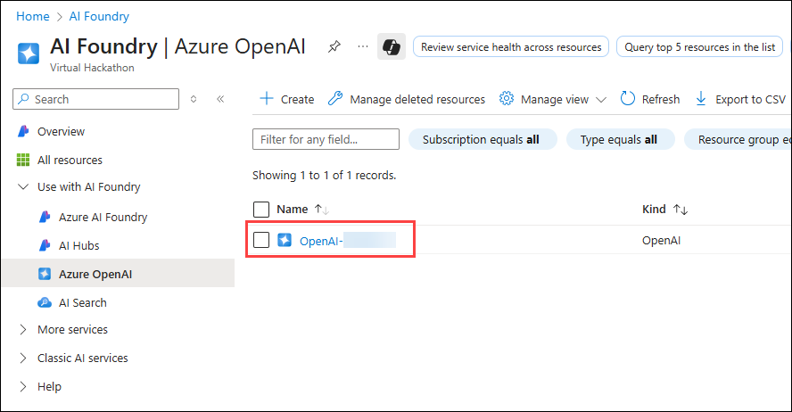

1. On the **Azure OpenAI** page, click **Go to Azure AI Foundry portal** to proceed to the AI Foundry interface

   

   > **Note:** If you don’t see an option like the one shown in the image above, refer to the image below to navigate to Azure AI Foundry.

      

## Task 2: Upload your own data

In this task, you will upload Porsche's owner manuals (Taycan, Panamera, Cayenne) to Azure OpenAI Studio for use in a custom chat model.

1. Click on **Chat (1)** under the Playgrounds section, then in the **Setup** tab of the Chat playground, expand **Add your data (2)** and click **+ Add a data source (3)** to connect your own data.

   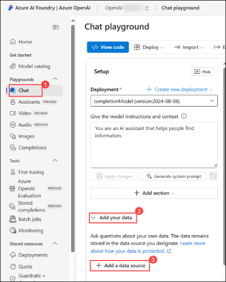
   
1. Fill in the required fields on the **Select or add data source** page as follows:
    
    - Select data source: **Upload files (preview)** **(1)**.

    - Subscription: Select your **Default Subscription (2)** from the drop-down.

    - Select Azure Blob storage resource: Choose the already created storage account **storage<inject key="Deployment ID">** **(3)**. 
      
    - Click on **Turn on CORS (4)** when prompted.

         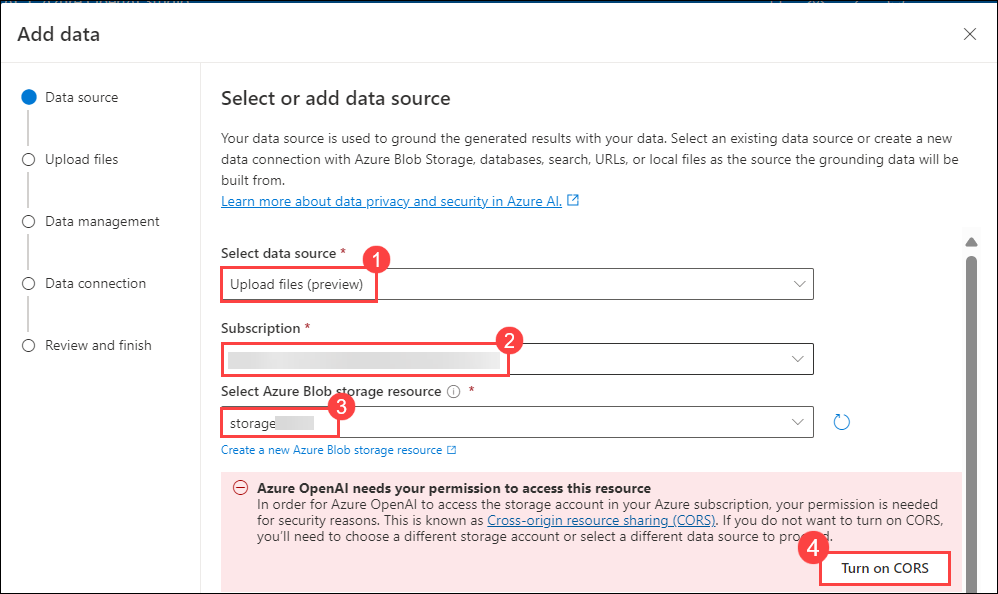

      > **Note:** If you encounter any issues while enabling CORS, please follow the steps below :

         - Navigate to the Azure portal.
         - Search for storage account in the search bar and select **storage<inject key="Deployment ID" enableCopy="false"/>**.
         - In the left pane, search for **CORS (1)** and select **Resource sharing (CORS) (2)**.

            
          
         - In the first row, ensure only **GET**, **POST**, **OPTIONS**, **PUT** **(1)** is enabled under allowed methods, provide it as **content-length** **(2)** under exposed headers and set the Max age to **120** **(3)**.
         - In the second row, set the Allowed origins to `*` **(4)**, enable **GET**, **POST**, **OPTIONS**, **PUT** **(5)** under allowed methods, set the Allowed headers and Exposed headers to `*` **(6)** and `*` **(7)** respectively and the Max age to **200 (8)**.
         - Click on **Save**.
          
           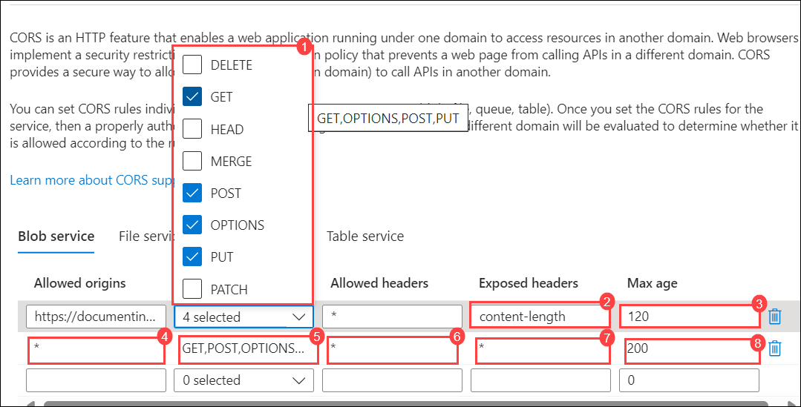

         - Navigate back to the Azure AI Foundry portal, close the window, and re-perform steps 1 and 2.
            
    - Select Azure AI Search resource: Select **search-<inject key="Deployment ID">** **(1)** from the drop down.

    - Enter the index name: **aoaiworkshop** **(2)**
      
    - Click on **Next (3)**

      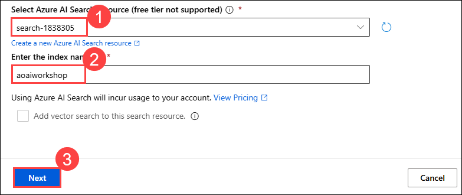
      
1. On the **Upload files** tab, click **Browse for a file (1)**. Navigate to the path `C:\LabFiles\Data\Lab 2` **(2)** and press **Enter**. Select all the **PDF files (3)** in this folder, then click **Open (4)** to upload them. 

   

1. Click on **Upload files** **(1)**, and then click **Next** **(2)**.

   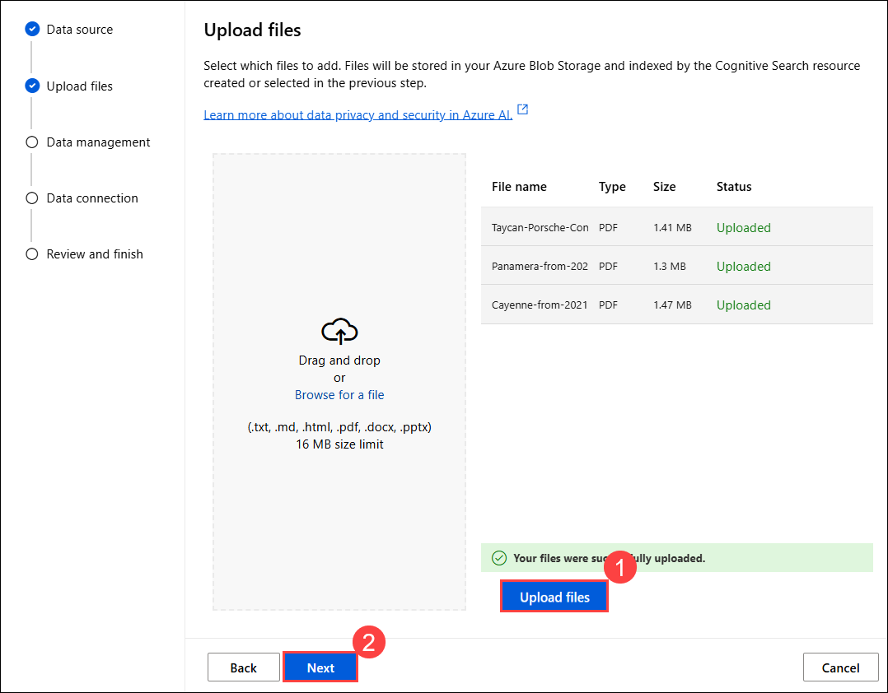

1. On the **Data Management** page, from the drop-down select **Keyword (1)** as the Search type and click **Next (2)**.

   

1. On the **Data Connection** step, choose **API Key (1)** as the **Azure resource authentication type**, then proceed by clicking **Next (2)**.

   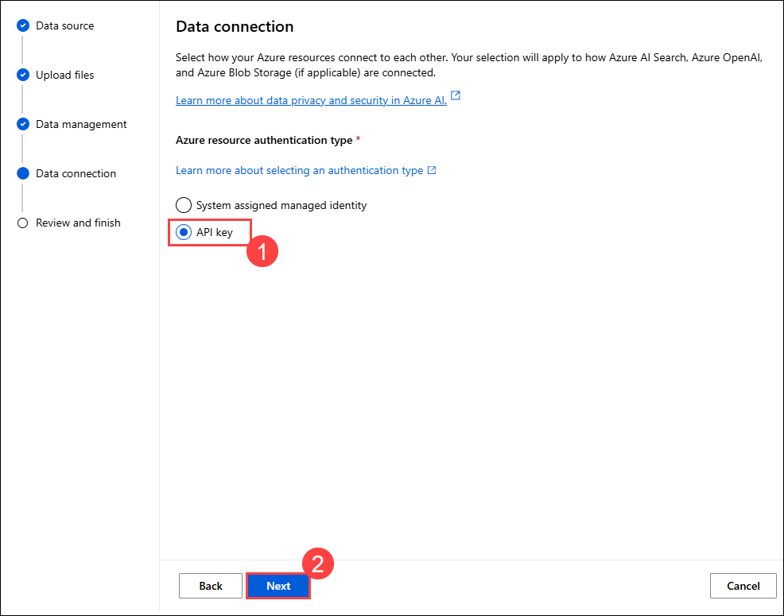

1. On the **Review and finish** page, verify the configuration details, then click **Save and close** to complete the data source setup.

   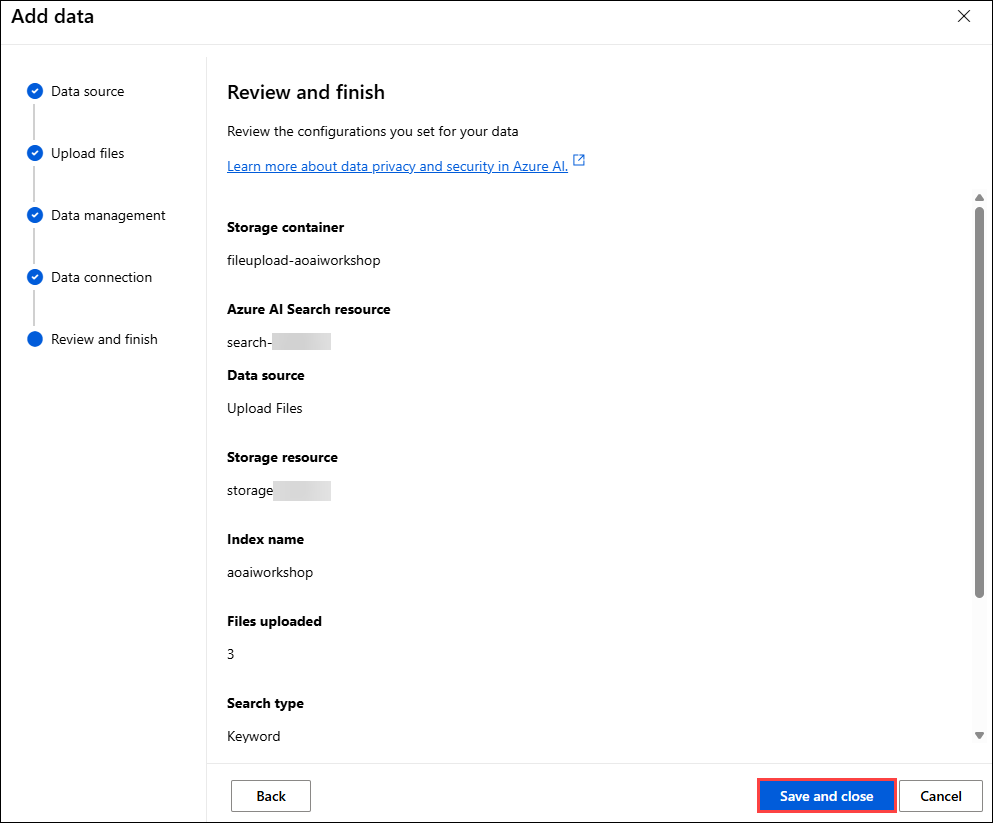

## Task 3: Interact with Azure OpenAI ChatGPT LLM using your own data

In this task, you will upload custom data to Azure AI Foundry and interact with an Azure OpenAI ChatGPT model. You will customize the system message, test prompt responses, adjust model parameters, and deploy the chatbot as a web app via the Azure portal. The task also includes verifying conversation logging in Azure Cosmos DB and provides steps to troubleshoot deployment issues if needed.

1. In the **Add your data** pane, monitor the status until the data upload is complete and the source details are displayed.

   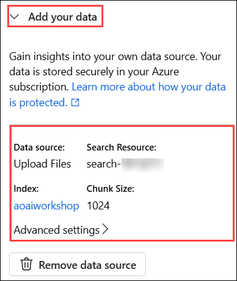

1. Under the **Chat Session** pane, begin testing your prompts by entering queries as shown below:

    ```
    How to operate Android Auto in the Porsche Taycan? give step-by-step instructions
    ```

      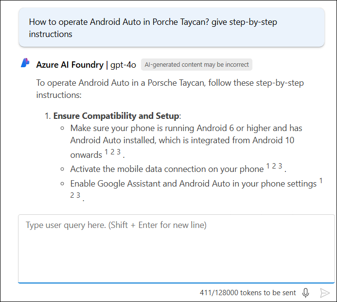

1. Customize your bot's responses by updating the **message (1)** under **Give the model instructions and context**, then click **Apply changes (2)**.


    ```
    Your name is Alice. You are an AI assistant that helps people find information about Porsche cars. Your responses should not contain any harmful information 
    ```

   

1. On **Update system message?** pop-up, click on **Continue**.

   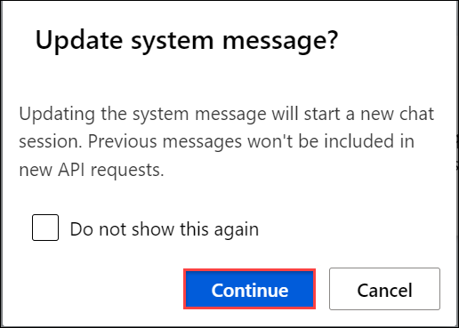

1. Under the **Chat Session** pane, begin testing your prompts by entering queries as shown below:

    ```
    What is your name?
    ```
   
   

1. In the **Setup** pane, scroll down to **Parameters** and expand it, experiment with different settings to observe how they affect the model's behavior.

    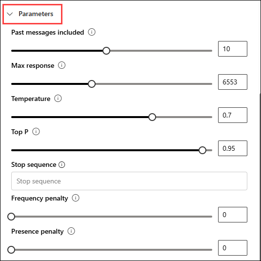

1. In the **Chat playground**, click on **Deploy (1)** in the top menu bar and select **…as a web app (2)** from the drop-down menu.

   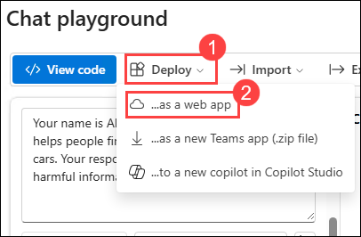

1. Add the following details and click on **Deploy (7)**

   - Name: **webapp-<inject key="Deployment ID" enableCopy="false"/> (1)**
   - Subscription: Select the **Default subscription (2)**
   - Resource Group: Select **OpenAI-<inject key="Deployment ID" enableCopy="false"/>** **(3)**
   - Location: Select **Sweden Central (4)**
   - Pricing Plan: Choose **Standard (S1) (5)**
   - Check the box for **Enable chat history in the web app** **(6)**

     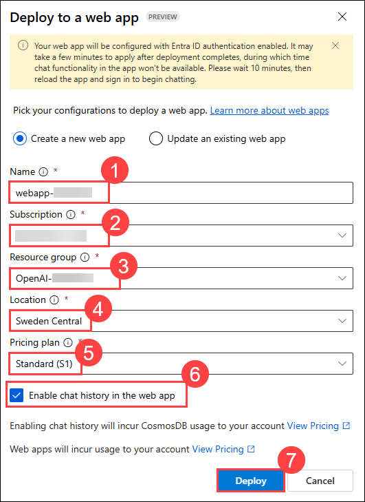

     > **Note:** Wait for 10 minutes for the webapp to be deployed successfully.

1. In the Azure Portal, search for **App Services (1)** in the search bar and select **App Services (2)** from the **Services**. 

      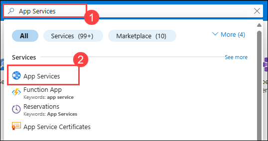

1. Select the **webapp-<inject key="Deployment ID" enableCopy="false"/> (1)** App Service.

      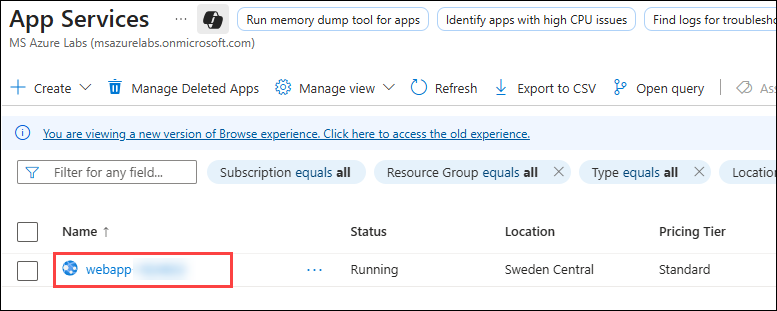
      
1. Click **Browse** from the top menu bar to open and verify that the web app is running successfully after deployment.

    
    
    

      > **Note:** If you see a blank screen, wait for some time and refresh the page.

      > **Note:** In cases of permissions asked, click on **Accept**.

      

      > **Note:** In case of an internal server error or **Chat history is not enabled** error, navigate back to the **Azure AI Foundry portal** and follow the steps below:

      

   - In the **Chat (1)** section under Chat playgrounds, click **Deploy (2)** in the top menu bar, then select **...as a web app (3)** from the drop-down menu.

       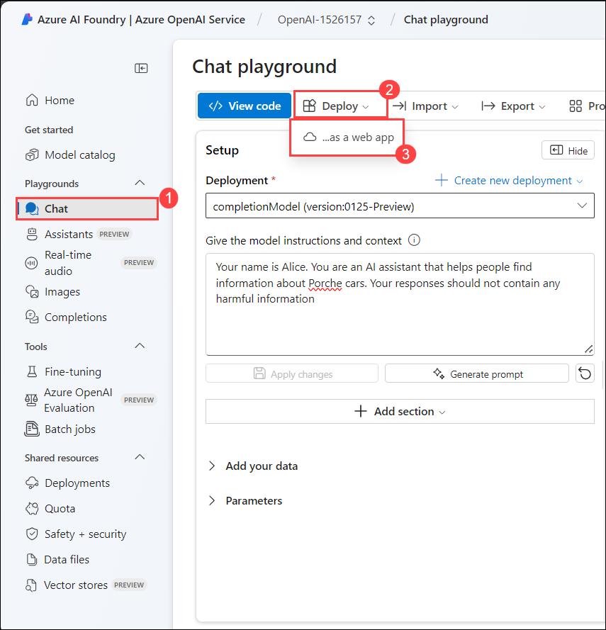

   - Click on **Update an existing web app (1)**, select the **default subscription (2)**, then choose **webapp-<inject key="Deployment ID" enableCopy="false"/> (3)**. Check the box for **Enable chat copilot in web app (4)**, and finally, click **Deploy (5)**.
     
      .png)
     
   - Navigate to **App Services**, select **webapp-<inject key="Deployment ID" enableCopy="false"/>**, click on **Deployment (1)**, then select **Deployment Center (2)**. Go to the **Logs** tab and verify that the status is **Success (3)**.

      %20-%20Copy.png)
     
   - Click on **Browse** from the overview tab again.

      

     >**Note:** If the internal server issue continues, restart the web app and then try accessing it. Please note that it may take some time to become available.
     
1. Interact with the chatbot by entering queries related to the documents you previously uploaded to verify its functionality.

    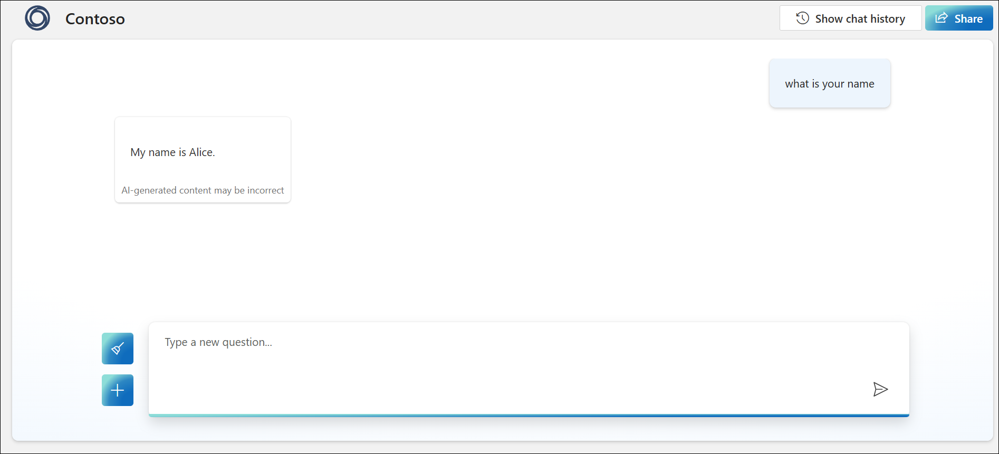

1. In the Azure Portal, search for **Azure Cosmos DB (1)** and select **Azure Cosmos DB (2)** from the **Services**.

    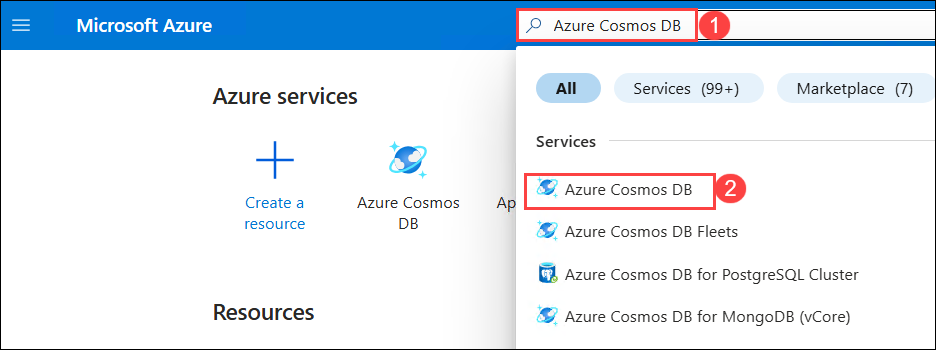

1. Verify **db-webapp-<inject key="Deployment ID" enableCopy="false"/>** has been created, then **select** it.
   
   %20-%20Copy.png)

1. In the **db-webapp-<inject key="Deployment ID" enableCopy="false"/>** instance, navigate to **Data Explorer (1)** within your Azure Cosmos DB account. Expand the **conversations (2)** container and selects **items (3)**. Confirm that the **conversation data (5)** from the web app is successfully recorded by reviewing the displayed **documents (4)**.

    

>**Congratulations** on completing the Task! Now, it's time to validate it. Here are the steps:
> - Hit the Validate button for the corresponding task. If you receive a success message, you have successfully validated the lab. 
> - If not, carefully read the error message and retry the step, following the instructions in the lab guide.
> - If you need any assistance, please contact us at cloudlabs-support@spektrasystems.com.

<validation step="ba1751b9-d16b-47ac-9282-a6ecc8cb4870" />
   
## Summary

In this lab, you have completed the following:

- Navigated to the Azure OpenAI Playground.
- Uploaded and integrated your own data.
- Interacted with the Azure OpenAI ChatGPT model using your uploaded data.

## You have successfully completed the Hands-on lab.

By completing this lab, you gained hands-on experience with Azure AI Foundry to extend ChatGPT with your own data. You configured the system to respond to domain-specific queries, deployed the model as a web application, and validated that all interactions were successfully logged in Cosmos DB. This exercise demonstrated how to build, deploy, and monitor a customized AI-powered solution end-to-end.
