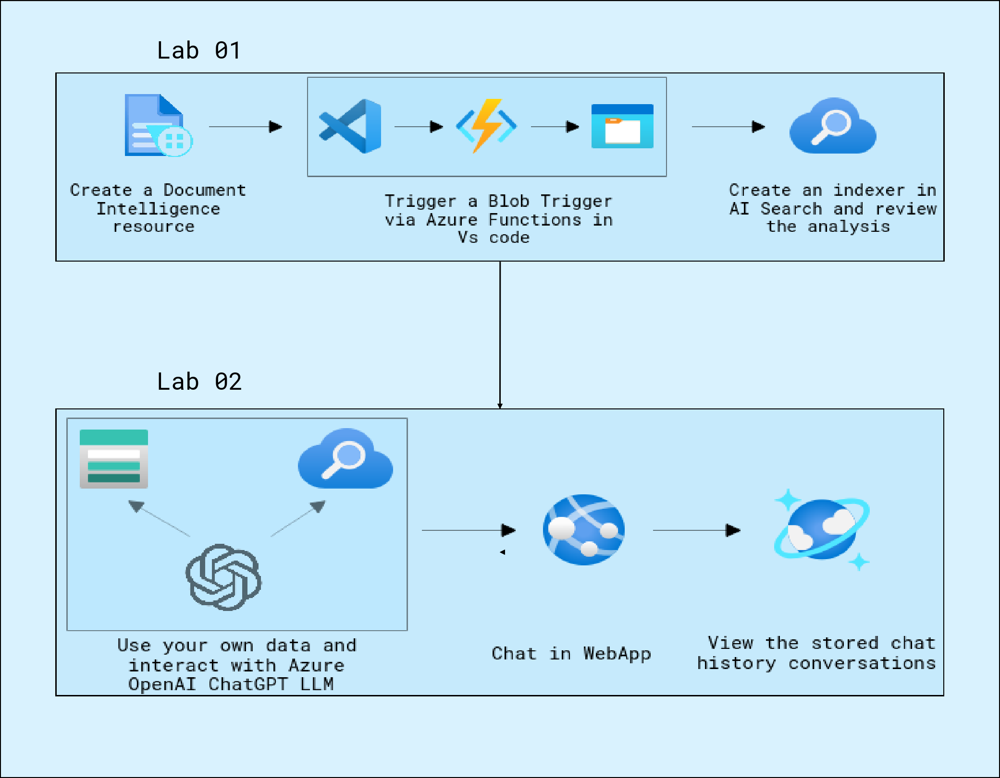
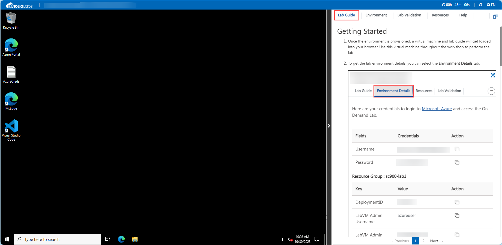
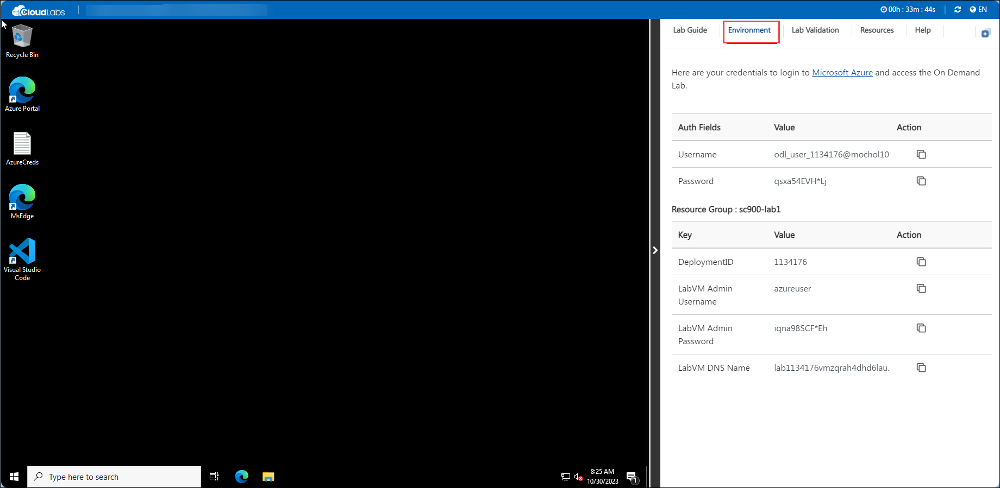
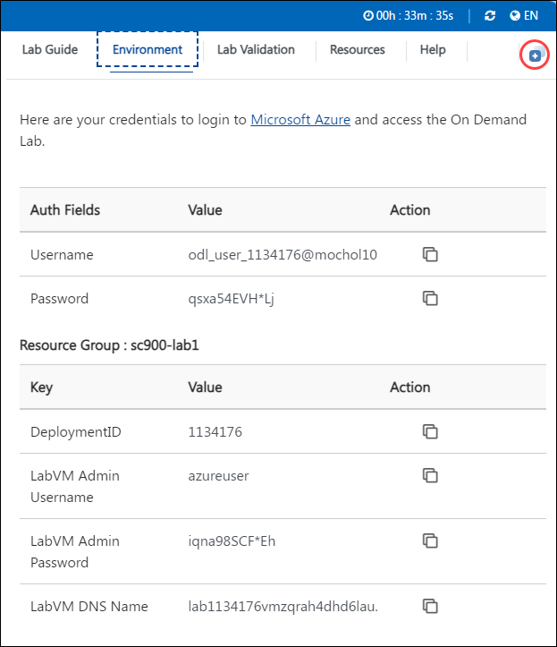

# Automate document processing using Azure OpenAI
### Overall Estimated Duration: 4 Hours
## Overview

In this lab, participants will explore document processing using Azure services to streamline and enhance the management of various document types. The focus will be on leveraging Azure's capabilities for analyzing and extracting data from documents, whether in electronic or printed formats. The lab will cover the end-to-end process, including data extraction, sentiment analysis, language detection, OCR, and document classification. Participants will utilize Azure tools such as the Document Intelligence resource, Azure Functions for blob triggers, and AI Search for document analysis. Additionally, they will integrate their processed data with Azure OpenAI's ChatGPT LLM via a web application and Cosmos DB to assess and interact with the information effectively.

## Objectives
Use Azure services to automate document processing, including data extraction, sentiment analysis, OCR, and classification. They will integrate Azure OpenAI's ChatGPT and Cosmos DB to analyze and interact with the processed data through a web application.

- **Automate document processing using AzureOpenAI:** Learn how to upload custom data into Azure OpenAI Studio, interact with the ChatGPT model using the uploaded content, and deploy the AI as a web app. Additionally, capture and store conversation history in Cosmos DB for enhanced traceability and persistence.

- **Utilize your Data Set using OpenAI:** Explore how Azure services can be used to process documents by extracting and analyzing information from various file types, such as PDFs and images. Train document models via Azure Document Intelligence and integrate them with Azure OpenAI for intelligent data extraction and interaction.
  
## Prerequisites

Participants should have basic knowledge and understanding of the following:

- Familiarity with AI concepts.
- Experience with Azure cloud services, including how to navigate the Azure portal.
- Basic knowledge of programming languages commonly used with AI models, such as Python.
  
## Architecture

**Azure Document Intelligence** processes and extracts data from documents. **Azure Functions** trigger the document processing based on blob changes. **Azure Storage Account** stores the documents to be processed. **Azure AI Search** indexes and searches the extracted data. **Azure OpenAI Service** provides AI capabilities for natural language processing and generation. **Web Application** facilitates user interaction and displays the results of the AI processing. A storage mechanism stores chat history for viewing and analysis.

## Architecture Diagram

## Explanation of Components

The architecture for this lab involves the following key components:

- **Azure Document Intelligence:** Document Intelligence in Azure is a service that uses AI to extract structured data from unstructured documents.
- **Azure Functions:** is a serverless compute service that allows you to run code without having to provision or manage infrastructure. You can write code in various languages and trigger it based on events like HTTP requests, timers, or messages from queues or topics
- **Azure AI Search:** is a cloud-based search service that allows you to add search capabilities to your applications. It provides features like autocomplete, faceted search, and spell correction, making it easy for users to find relevant information.
- **Azure Function app:** is a collection of Azure Functions that are grouped together and share the same configuration settings. It provides a way to manage and deploy multiple functions as a single unit.
- **Azure OpenAI:** is a service that provides access to OpenAI's powerful language models, such as GPT-3 and GPT-4, through Azure's cloud platform. This allows developers to build applications that can generate human-quality text, translate languages, write different kinds of creative content, and answer your questions in an informative way.
- **Azure Web App:** is a fully managed platform for building, deploying, and scaling web applications. It supports various programming languages and frameworks,and offers features like continuous deployment, scaling, and integration with other Azure services.

## Getting Started with the Lab
Welcome to your Automate-document-processing-using-AzureOpenAI Workshop! We've prepared a seamless environment for you to explore and learn about Azure services. Let's begin by making the most of this experience.
 
## Accessing Your Lab Environment
 
Once you're ready to dive in, your virtual machine and lab guide will be right at your fingertips within your web browser.

  

 
## Exploring Your Lab Resources
 
To get a better understanding of your lab resources and credentials, navigate to the **Environment** tab.
 
  
 
## Utilizing the Split Window Feature
 
For convenience, you can open the lab guide in a separate window by selecting the **Split Window** button from the Top right corner.
 
  

## Managing Your Virtual Machine
 
Feel free to start, stop, or restart your virtual machine as needed from the **Resources** tab. Your experience is in your hands!

  

## Let's Get Started with Azure Portal
 
1. On your virtual machine, click on the **Azure Portal** icon as shown below:
 
    .png)

1. On the **Sign in to Microsoft Azure** tab you will see the login screen, in that enter the following email/username, and click on **Next**. 

   * **Email/Username**: <inject key="AzureAdUserEmail"></inject>
   
      
     
1. Now enter the following password and click on **Sign in**.
   
   * **Password**: <inject key="AzureAdUserPassword"></inject>
   
      

1. If you see the pop-up **Action Required**, keep default and then click on **Ask later**. If you see the pop-up Help us protect your account, click on **Skip for now**(14 days until this is required), and then click on **Next**.

   

   >**NOTE:** Do not enable MFA, select **Ask Later**.
     
1. If prompted to **stay signed in**, you can click **"No"**.
 
1. If a **Welcome to Microsoft Azure** pop-up window appears, simply click "Maybe Later" to skip the tour.
   

## Support Contact
The CloudLabs support team is available 24/7, 365 days a year, via email and live chat to ensure seamless assistance at any time. We offer dedicated support channels tailored specifically for both learners and instructors, ensuring that all your needs are promptly and efficiently addressed.

Learner Support Contacts:

   - Email Support: cloudlabs-support@spektrasystems.com
   - Live Chat Support: https://cloudlabs.ai/labs-support

Now you're all set to explore the powerful world of technology. Feel free to reach out if you have any questions along the way. Enjoy your workshop!

Now, click on **Next** from the lower right corner to move on to the next page.

  

## Happy Learning!!
