# Lab 02: Utilize your Data Set using OpenAI

### Estimated Duration: 1 Hour

In this lab, you will learn how to leverage Azure OpenAI to interact with custom data using the ChatGPT model. By uploading your own data into Azure OpenAI Studio, you will enable specific, tailored responses to user queries based on the uploaded content. The lab covers steps to upload files, configure the system to manage queries effectively, and deploy the ChatGPT model as a web app. Additionally, the interactions are captured and stored in Cosmos DB, ensuring traceability and persistence of conversation history. This lab provides hands-on experience with customizing AI responses and deploying AI models in a real-world application.
  
## Architecture Diagram


## Lab Objectives
In this lab you will perform,

- Task 01: Navigate to Azure OpenAI Playground
- Task 02: Upload your own data
- Task 03: Interact with Azure OpenAI ChatGPT LLM using your own data

## Task 1: Navigate to Azure OpenAI Playground

1. In `portal.azure.com`, search for **openai** and select **Azure OpenAI**.

   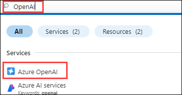

2. In the Azure AI Services | Azure OpenAI tab, select **OpenAI-<inject key="Deployment ID" enableCopy="false"/>**.

      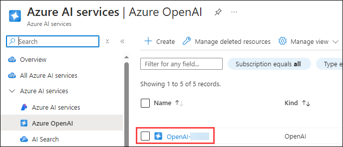

3. On the **Azure OpenAI** page, click on **Go to Azure OpenAI Studio**.

      

4. On the **Azure OpenAI Studio**, scroll down and click on **Bring your own data**.

   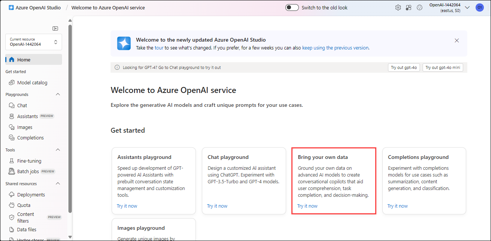

## Task 2: Upload your own data

In this step, we will be using Porche's owner manual for Taycan, Panamera, and Cayenne models.

1. Click on **+ Add a data source** under **Add your data** of the **Setup** tab.

   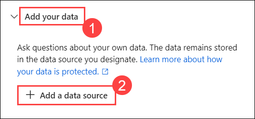
   
1. Fill the following details in **Select or add data source** and click on **Next** **(6)**.
    
    - Select data source: **Upload files (preview)** **(1)**

    - Subscription: Select your **subscription** from the drop-down section **(2)**

    - Select Azure Blob storage resource: Choose the already created storage account **storage<inject key="Deployment ID">** **(3)**. 
      
      - **Note**: **Turn on CORS** when prompted.

         

    - Select Azure Cognitive Search resource: Select the search service **search-<inject key="Deployment ID">** **(4)**.

    - Enter the index name: Give an index name as **aoaiworkshop** **(5)**
      
    - Click on **Next**
      
1. On the **Upload files**, click on **Browse for a file** **(1)** enter the following `C:\LabFiles\Data\Lab 2` **(2)** path and hit enter, select the **Panamera-from-2021-Porsche-Connect-Good-to-know-Owner-s-Manual** **(3)** pdf  file and click on **Open** **(4)** files.

   

1. Click on **Upload files** **(1)**, and click on **Next** **(2)**.

   

1. On the **Data Management** page, from the drop-down select **keyword (1)** as Search type and click on **Next (2)**.

   

1. On the **Data Connection page**, select **API Key** and click on Next.

   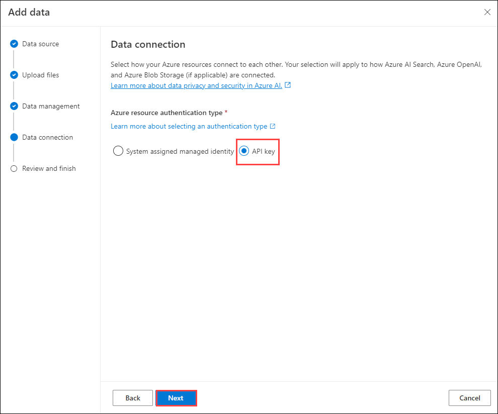

1. On the **Review and finish** page, click on **Save and close**.

   

### Task 3: Interact with Azure OpenAI ChatGPT LLM using your own data

1. Under the **Add you data** pane , wait until your data upload is finished.

   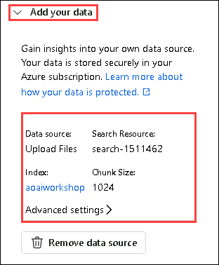

1. Under the **Chat Session** pane, you can start testing out your prompts by entering the query like this.

    ```
    how to operate Android Auto in Porche Taycan? give step-by-step instructions
    ```

      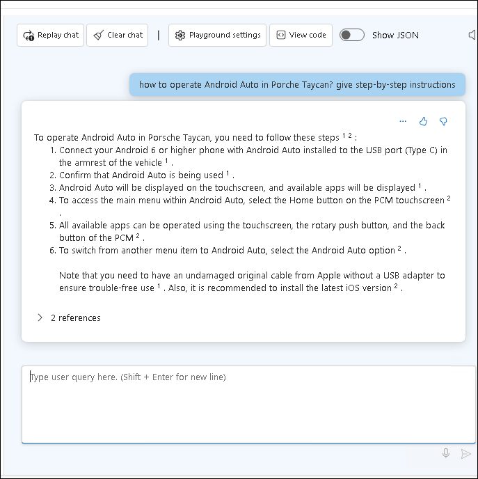

1. You can customize the responses of your bot by  updating the message `Your name is Alice. You are an AI assistant that helps people find information about Porche cars. Your responses should not contain any harmful information` **(1)** under **Give the model instructions and context**  and click on **Save** **(2)**.

   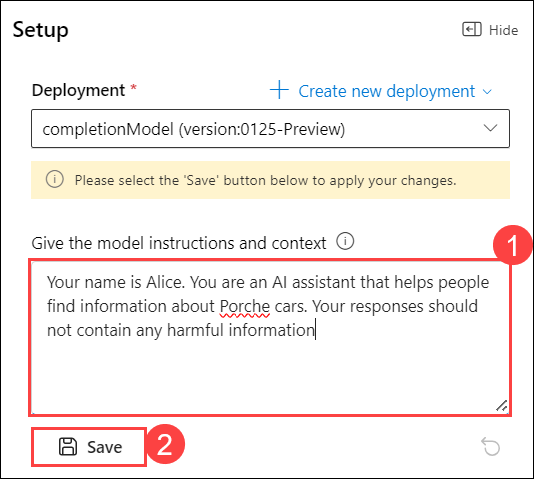

1. On **Update system message?** pop-up, click on **Continue**.

   

1. Under the **Chat Session** pane, you can start testing out your prompts by entering the query like this.

    ```
    What is your name
    ```
   
   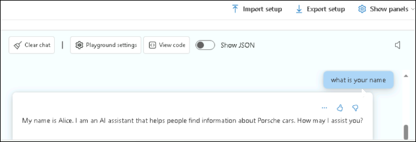

1. In the **Configuration** pane, click on **Parameters**. You can try and experiment with different parameter configurations to see how they change the behavior of the model.

    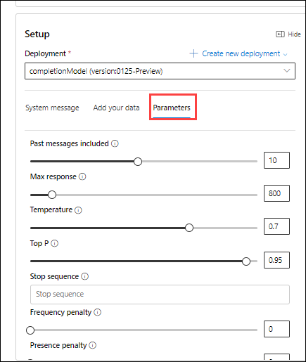

1. On the **Chat (1)** , Click on **Deploy to (2)** on the top right and click on **as a webapp (3)**.

   

1. Add the following details and click on **Deploy**:

   - Name: **webapp-<inject key="Deployment ID" enableCopy="false"/> (1)**
   - Subscription: **Select the default subscription (2)**
   - Resource Group: Select **OpenAI-<inject key="Deployment ID" enableCopy="false"/>** **(3)**
   - Location: **Select Sweden Central (4)**
   - Pricing Plan: **Choose Standard (S1) (5)**
   - **Enable** chat history in the web app **(6)**
   - Click **Deploy (7)**

     

1. Verify the successful deployment of the app in openai studio by navigating to **Deployments (1)**, click on **App Deployments (2)** and verify the webapp is in **Succeeded (3)** state.

     
    
1. Navigate to App Services and verify **webapp-<inject key="Deployment ID" enableCopy="false"/> (1)** has been created.

      

      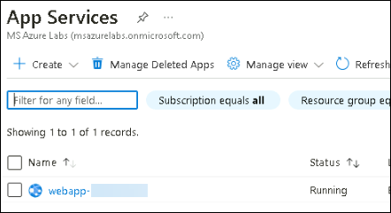
   
      > **Note:** In cases of permissions asked, click on **Accept**.

      
      
1. Click on **Browse** and the web app is up and running.

    

      > **Note:** In cases of an internal server error, navigate back to Azure OpenAI studio and follow the below steps:

   - On the **Chat (1)** , Click on **Deploy to (2)** on the top right and click on **as a webapp (3)**.

       

   - Click on **Update an existing web app (1)**, select the **default subscription (2)** and select **webapp-<inject key="Deployment ID" enableCopy="false"/>** (3), check in the box for **Enable chat copilot in web app (4)** and click on **Deploy (5)**.
     
      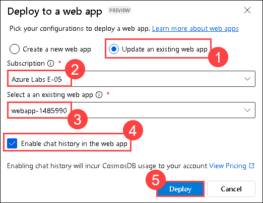
     
   - Navigate to App servives, select **webapp-<inject key="Deployment ID" enableCopy="false"/>**, click on **Deployment (1)**, select **Deployment center (2)** and click on Logs and verify its in **success (3)** state.

      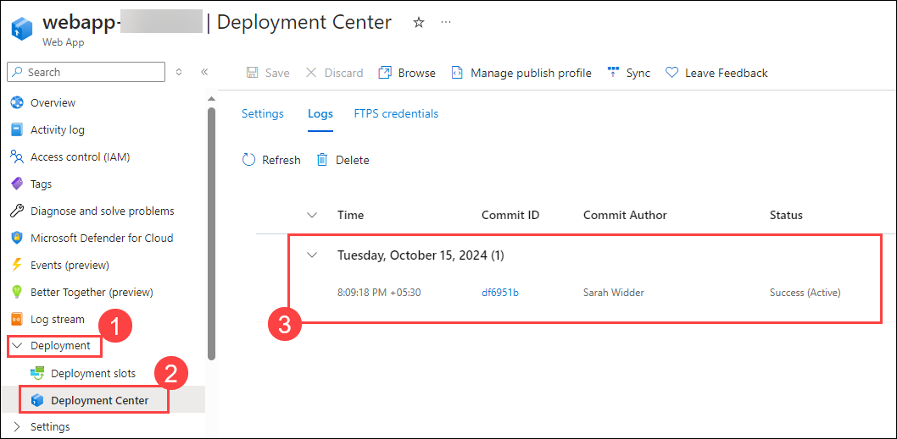
     
   - Click on **Browse** from the overview tab again.
     
1. Chat with the bot and check its working state. Provide questions related to the document we had previously uploaded.

1. Search for cosmos DB in the portal and select the resource.

    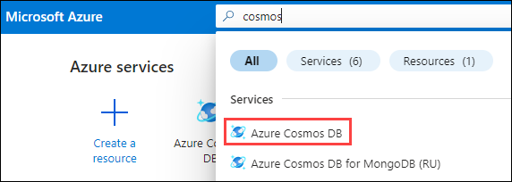

1. Verify **db-webapp-<inject key="Deployment ID" enableCopy="false"/>** has been created.

1. Go to Data Explorer, expand **db_conversation_history** database **(1)** > **conversations** container **(2)** and verify that the conversations has been captured by cosmos db from webapp as shown in the below image.

    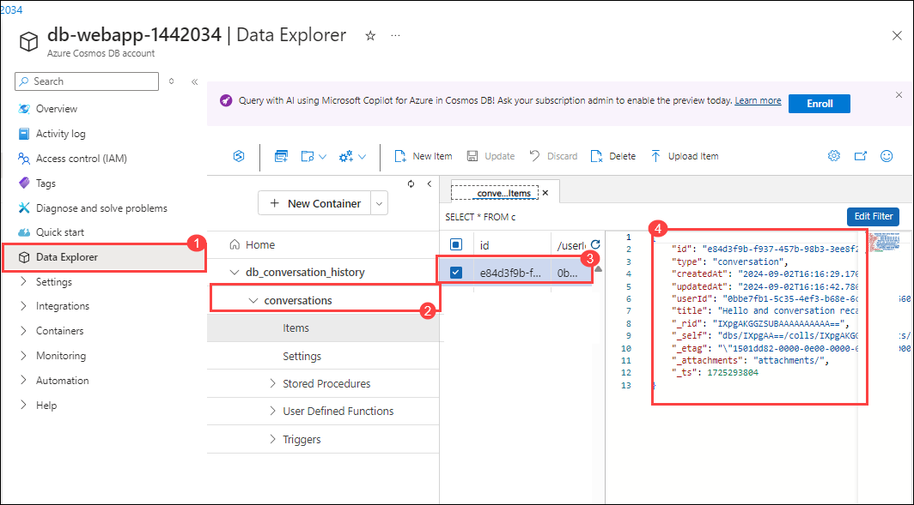

<validation step="ba1751b9-d16b-47ac-9282-a6ecc8cb4870" />
 
>**Congratulations** on completing the Task! Now, it's time to validate it. Here are the steps:
> - Hit the Validate button for the corresponding task. If you receive a success message, you have successfully validated the lab. 
> - If not, carefully read the error message and retry the step, following the instructions in the lab guide.
> - If you need any assistance, please contact us at cloudlabs-support@spektrasystems.com.
   
## Summary

In this lab, you learned how to use Azure OpenAI Studio to upload your own data, and interact with the ChatGPT model using that data. You configured the system to handle specific queries and deployed the model as a web app. Finally, you verified that interactions were captured in Cosmos DB, completing the lab successfully.

### You have successfully completed the lab
