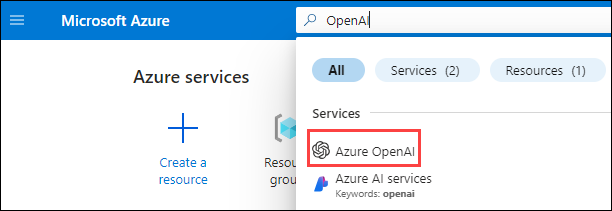
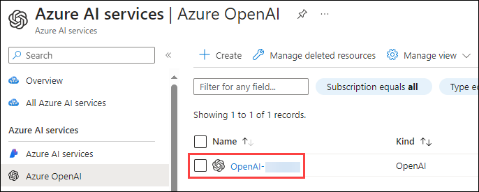
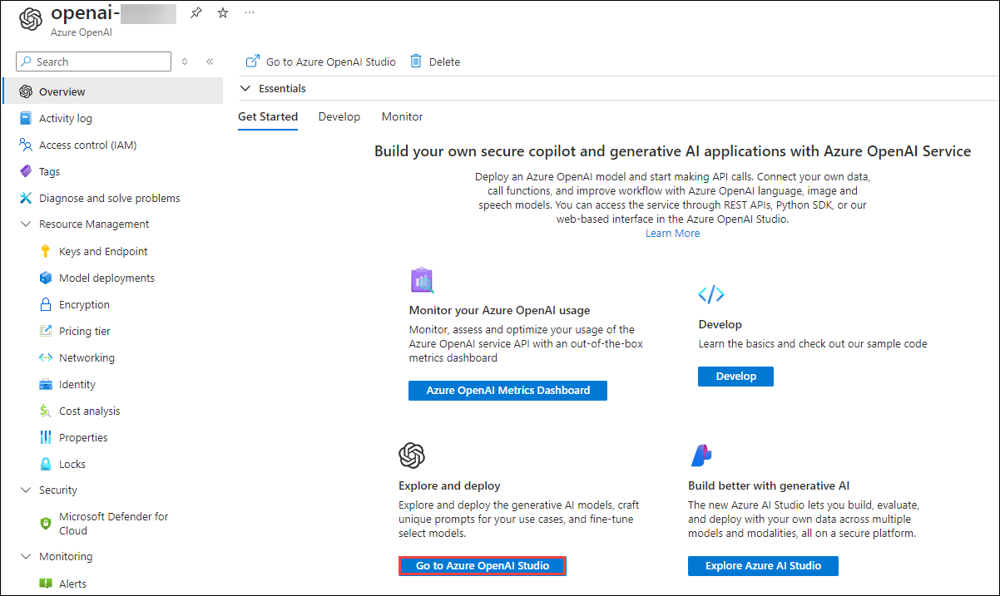
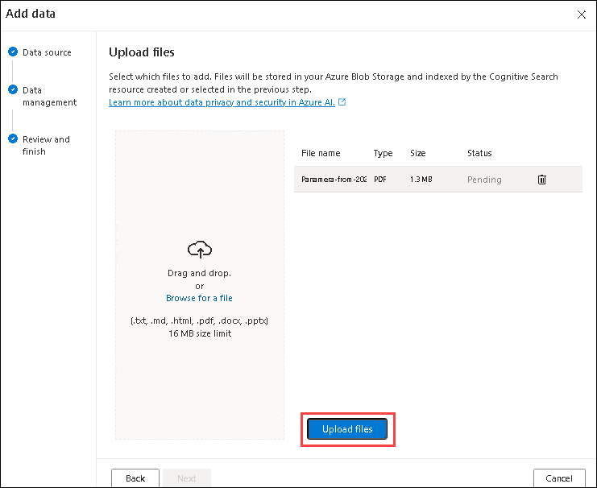
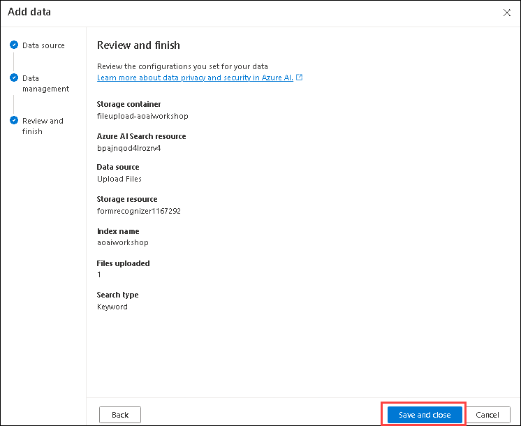
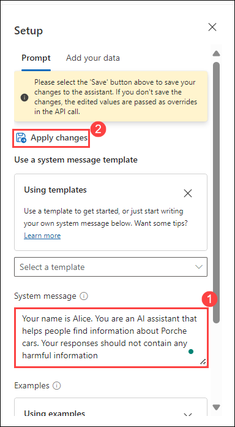
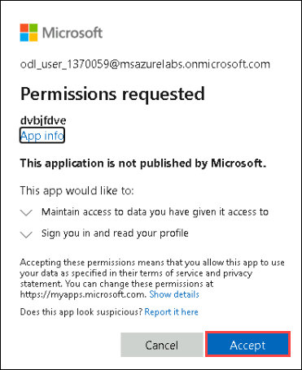

# Utilize your Data Set using OpenAI

### Architecture Diagram


### Task 1: Navigate to Azure OpenAI Playground

1. In `portal.azure.com`, search for openai and select **Azure OpenAI**.

   

2. Click on **OpenAI-<inject key="Deployment ID" enableCopy="false"/>**.

      

3. On the **Azure OpenAI** page, click on **Go to Azure OpenAI Studio**.

      

4. On the **Azure OpenAI Studio**, scroll down click on **Bring your own data**.

   

### Task 2: Upload your own data

In this step, we will be using Porche's owner manual for Taycan, Panamera, and Cayenne models.

1. Fill the following details in **Select or add data source** and click on **Next** **(6)**.
    
    - Select data source: **Upload files (preview)** **(1)**

    - Subscription: Select your subscription from the drop-down section **(2)**

    - Select Azure Blob storage resource: Choose the already created storage account **storage<inject key="Deployment ID">** **(3)**. 
      
      - **Note**: If asked for turn on CORS, click on **Turn on CORS**.

         

    - Select Azure Cognitive Search resource: Select the search service **search-<inject key="Deployment ID">** **(4)**.

    - Enter the index name: Give an index name as **aoaiworkshop** **(5)**.

       

2. On the **Data Management**, click on **Browse for a file** **(1)** enter the following `C:\LabFiles\Data\Lab 2` **(2)** path and hit enter, select the **Panamera-from-2021-Porsche-Connect-Good-to-know-Owner-s-Manual** **(3)** pdf  file and click on **Open** **(4)** files.

   

3. It will redirect to **Data management**, click on **Upload files** **(1)**, and click on **Next** **(2)**.

   

4. On the **Data Management** page, from the drop-down select **keyword (1)** as Search type and click on **Next (2)**.

   

5. On the **Data Connection page**, select **API Key**.

   

6. On the **Review and finish** page, click on **Save and close**.

   

### Task 3: Interact with Azure OpenAI ChatGPT LLM using your own data

1. Under the **Assistant Setup** pane, wait until your data upload is finished.

   

   

2. Under the **Chat Session** pane, you can start testing out your prompts by entering the query like this.

    ```
    how to operate Android Auto in Porche Taycan? give step-by-step instructions
    ```

      

3. You can also configure the responses of your bot by selecting the system message under **Assistance Setup**, and click on **System message** **(1)** to replace the value under the system message with `Your name is Alice. You are an AI assistant that helps people find information about Porche cars. Your responses should not contain any harmful information` **(2)** and click on **Save changes** **(3)**. Here we have edited the default system message.

   

4. On **Update system message?** pop-up, click on **Continue**.

   

5. Under the **Chat Session** pane, you can start testing out your prompts by entering the query like this.

    ```
    What is your name
    ```
   
   

6. In the **Configuration** pane, click on **Parameters**. You can try and experiment with different parameter configurations to see how they change the behavior of the model.

    

7. Click on **Deploy to** on the top right and click on **a new webapp**.

8. Add the following details and click on **Deploy**:

   - Name: **webapp-<inject key="Deployment ID" enableCopy="false"/> (1)**
   - Subscription: **Select the default subscription (2)**
   - Resource Group: Select **OpenAI-<inject key="Deployment ID" enableCopy="false"/>** **(3)**
   - Location: **Select East US (4)**
   - Pricing Plan: **Choose Basic (B1) (5)**
   - **Enable** chat history in the web app **(6)**

9. Navigate to App Services and verify **webapp-<inject key="Deployment ID" enableCopy="false"/> (1)** has been created.

      > **Note:** In cases of permissions asked, click on **Accept**.

      
      
10. Click on **Browse** and the web app is up and running.

    

12. Chat with the bot and check its working state.
## Review

In this lab, you have accomplished the following:

* How to leverage the ChatGPT LLM to extract a concise summary from your own document repository using OpenAI.
